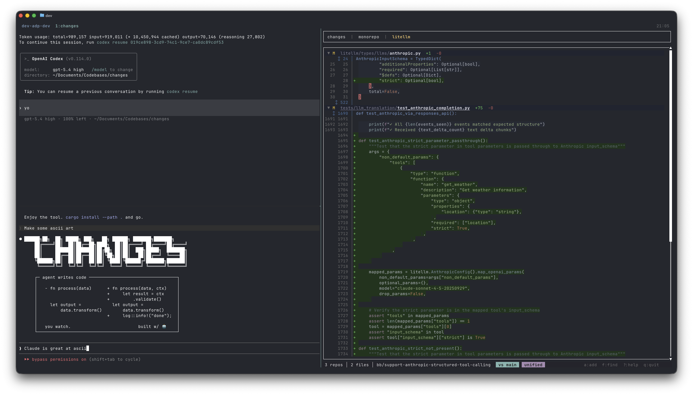
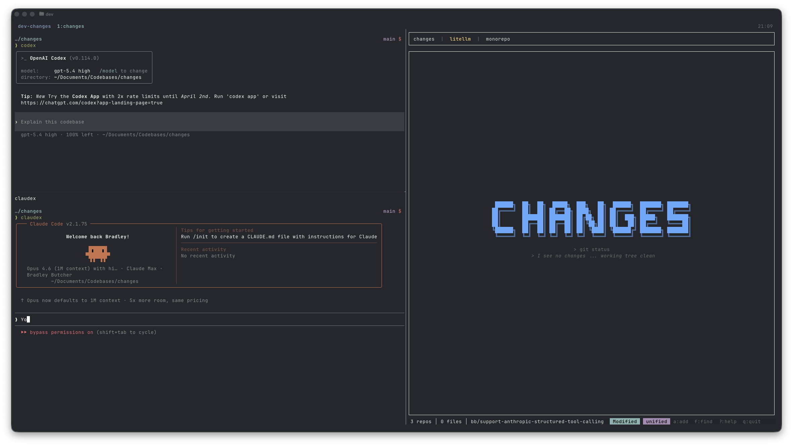

# changes

See what your AI agent is actually doing to your code — in real time.



`changes` is a terminal UI for reviewing git diffs live. It watches your repos and refreshes instantly as files change. No IDE required, no re-running commands. Just run `changes` and watch.

Built for the workflow where your agent writes code and you audit it. Think of it as a better `lazygit` where the focus is purely on *what changed* — not staging, committing, or pushing. You do that through your agent. This is your review pane.



## Why

I built this because I use lazygit — and it's great for git operations, but not great for *reviewing* agent changes. The diff pane is small, copying hunks is clunky, and it only handles one repo at a time. When you've got agents working across multiple repos simultaneously, you need something that gives all the screen real estate to the diff and makes it easy to copy code back to your agent.

It's also agent-agnostic. You shouldn't have to use a specific app or IDE just to get a good diff viewer — reviewing changes and running agents are two separate concerns. `changes` works with whatever you use: Claude Code, Codex, Cursor, Copilot, aider, or a shell script that calls `sed`. If it writes to files in a git repo, you can see the diff.

- **Full-screen diffs** — all the real estate goes to the code, not git operations
- Watch agent changes across **multiple repos** in tabs
- See **unstaged**, **staged**, or **branch diff** (vs main / parent branch)
- **Copy hunks** with a double-click and paste them back to your agent
- **Expand context** around changes — like GitHub, but better
- **Graphite-compatible** — auto-detects parent branch via `gt parent`

## Install

### Homebrew (macOS)

```sh
brew install Bradley-Butcher/tap/changes
```

### Pre-built binaries

Download from [GitHub Releases](https://github.com/Bradley-Butcher/Changes/releases):

```sh
# macOS (Apple Silicon)
curl -sSL https://github.com/Bradley-Butcher/Changes/releases/latest/download/changes-aarch64-apple-darwin.tar.gz | tar xz
sudo mv changes /usr/local/bin/

# macOS (Intel)
curl -sSL https://github.com/Bradley-Butcher/Changes/releases/latest/download/changes-x86_64-apple-darwin.tar.gz | tar xz
sudo mv changes /usr/local/bin/

# Linux (x86_64)
curl -sSL https://github.com/Bradley-Butcher/Changes/releases/latest/download/changes-x86_64-unknown-linux-gnu.tar.gz | tar xz
sudo mv changes /usr/local/bin/
```

### From source

```sh
cargo install --path .
```

## Usage

```sh
# Watch the current directory (auto-discovers repos)
changes

# Watch a specific repo
changes /path/to/repo

# Watch a directory containing multiple repos
changes /path/to/projects
```

If you point it at a directory with multiple git repos, it opens them all in tabs. You can also add repos on the fly with `a`.

## Keybindings

| Key | Action |
|-----|--------|
| `m` / `s` / `b` | Switch mode: modified, staged, branch diff |
| `v` | Toggle unified / side-by-side view |
| `j` / `k` | Scroll |
| `J` / `K` | Jump to next / previous file |
| `f` | Fuzzy file picker |
| `Enter` / Click header | Collapse / expand file |
| `c` / `e` | Collapse / expand all |
| `y` / Double-click | Copy hunk to clipboard |
| `a` / `x` | Add / remove repo tab |
| `Tab` / `1`-`9` | Switch tabs |
| Click gap indicator | Expand context |
| `?` | Help |
| `q` | Quit |

## Development

```sh
make check   # fmt, clippy, test, build
make fix     # auto-fix formatting and lint
make test    # tests only
make release # optimized build
```

## License

MIT
