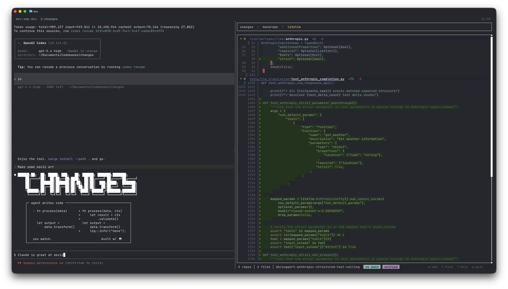
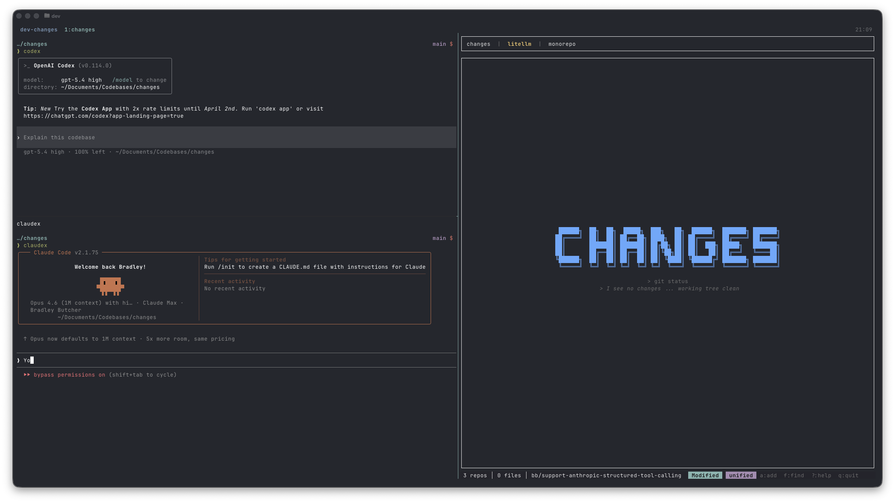

# changes

See what your AI agent is actually doing to your code — in real time.



`changes` is a terminal UI for reviewing git diffs live. It watches your repos and refreshes instantly as files change. No IDE required, no re-running commands. Just run `changes` and watch.

Built for the workflow where your agent writes code and you audit it. All the screen real estate goes to the diff — not staging, committing, or pushing. You do that through your agent. This is your review pane.

## Why

I built this because I use lazygit — and it's great for git operations, but not great for *reviewing* agent changes. The diff pane is small, copying hunks is clunky, and it only handles one repo at a time. When you've got agents working across multiple repos simultaneously, you need something that gives all the screen real estate to the diff and makes it easy to copy code back to your agent.

It's also agent-agnostic. You shouldn't have to use a specific app or IDE just to get a good diff viewer — reviewing changes and running agents are two separate concerns. `changes` works with whatever you use: Claude Code, Codex, Cursor, Copilot, aider, or a shell script that calls `sed`. If it writes to files in a git repo, you can see the diff.

- **Outline view** — press `o` for the shape of the change: a file tree with `+/-` counts and the functions, types and classes each hunk adds, removes or touches. Big diffs open here first
- **Callers and callees** — every changed function shows who calls it and what it calls, resolved with tree-sitter across the whole repo (Rust, Python, Go, JS/TS). New functions nobody calls and deleted functions that are still called are flagged
- **Multi-repo tabs** — watch agent changes across repos simultaneously
- **Two views that matter** — `m` for everything uncommitted, `b` for the whole branch against its base (uncommitted work included). `B` picks anything else: trunk, upstream, staged only, a typed ref
- **Annotate hunks** — right-click to add review comments, `Y` to copy all as markdown for your agent
- **Copy hunks** — double-click or press `y`, includes any attached comments
- **Expand context** — click gap indicators to reveal surrounding lines
- **Stack-aware** — detects the Graphite parent via `gt parent`, so `b` isolates the current PR and trunk shows the cumulative stack



## Install

### Homebrew (macOS)

```sh
brew install Bradley-Butcher/tap/changes
```

### Pre-built binaries

Download from [GitHub Releases](https://github.com/Bradley-Butcher/Changes/releases):

```sh
# macOS (Apple Silicon)
curl -sSL https://github.com/Bradley-Butcher/Changes/releases/latest/download/changes-aarch64-apple-darwin.tar.gz | tar xz
sudo mv changes /usr/local/bin/

# macOS (Intel)
curl -sSL https://github.com/Bradley-Butcher/Changes/releases/latest/download/changes-x86_64-apple-darwin.tar.gz | tar xz
sudo mv changes /usr/local/bin/

# Linux (x86_64)
curl -sSL https://github.com/Bradley-Butcher/Changes/releases/latest/download/changes-x86_64-unknown-linux-gnu.tar.gz | tar xz
sudo mv changes /usr/local/bin/
```

### From source

```sh
cargo install --path .
```

## Usage

```sh
# Watch the current directory (auto-discovers repos)
changes

# Watch a specific repo
changes /path/to/repo

# Watch a directory containing multiple repos
changes /path/to/projects
```

If you point it at a directory with multiple git repos, it opens them all in tabs. You can also add repos on the fly with `a`.

## What to compare

Two keys cover most of a review:

- `m` **Local** — everything the agent has done that isn't committed yet. Staged, unstaged and untracked files as one diff against HEAD. This is the default.
- `b` **Branch** — the whole unit of work: every commit since the fork point with the base branch, plus anything still uncommitted. The base is the Graphite parent if `gt` knows one, otherwise trunk (`origin/HEAD`, falling back to `main`/`master`). On trunk itself it compares against the upstream, which shows unpushed commits.

`B` opens the compare picker for everything else: trunk when you're in a stack (the cumulative diff), the upstream branch, staged or unstaged only, or any branch, tag or commit you type. Its **commits only** checkbox drops uncommitted work from branch views, for checking exactly what a PR will contain. The status-bar badge always shows what's being compared, and clicking it opens the picker.

In a stack `main ← pr1 ← pr2 ← pr3`, while on `pr3`: `b` shows pr3's work, `B` → `main` shows the whole stack.

## Example workflow

1. Your agent is working across two repos. Run `changes /path/to/projects` — both open in tabs
2. Scroll through the diff. See something wrong — right-click the hunk (or press `n`), type your feedback, `Ctrl+D` to save
3. Keep reviewing. Add more comments to other hunks across files
4. When you're done, press `Y` — all your comments get copied as markdown with the relevant code blocks
5. Paste into your agent. It gets something like:

```markdown
### src/auth.rs:42-58
> use env var instead of hardcoded API key

\`\`\`diff
+  let key = "sk-1234567890";
+  client.set_api_key(key);
\`\`\`

### src/handler.rs:115-130
> don't remove the try/catch, the API can 500

\`\`\`diff
-  let resp = client.call(req).await?;
+  let resp = client.call(req).await;
\`\`\`
```

6. Your agent fixes the issues. `changes` live-reloads. Comments are cleared. Review again.

## Keybindings

The `┃` gutter bar marks the hunk that `y` / `n` / `N` act on. Click a hunk or use `]` / `[` to move it.

| Key | Action |
|-----|--------|
| `m` | Local: uncommitted work vs HEAD (staged, unstaged, untracked) |
| `b` | Branch: everything since the fork point with the stack parent or trunk, uncommitted work included |
| `B` | Compare picker: trunk, upstream, staged, unstaged, a typed ref, and a "commits only" checkbox |
| `v` | Toggle unified / side-by-side view |
| `o` | Outline: file tree + changed symbols (`Enter` opens, `→`/`←` show/hide callers and callees, `y` copies as markdown) |
| `j` / `k`, `Ctrl+D` / `Ctrl+U`, `PgDn` / `PgUp` | Scroll by line, half page, page |
| `g` / `G` | Jump to top / bottom |
| `]` / `[` | Next / previous hunk |
| `J` / `K` | Next / previous file |
| `f` | Fuzzy file picker |
| `Enter` / Click header | Collapse / expand file |
| `c` / `e` | Collapse / expand all |
| `y` / Double-click | Copy hunk to clipboard |
| `n` / Right-click | Add or edit note on hunk |
| `N` | Remove note from hunk |
| `Y` | Copy all notes + hunks as markdown |
| `C` | Browse notes |
| `D` | Clear all notes |
| `p` | Preview focused markdown file |
| `a` / `x` | Add / remove repo tab |
| `Tab` / `Shift+Tab` / `1`-`9` | Switch tabs |
| Click `↕ N` | Expand hidden context lines |
| `?` | Help |
| `q` / `Ctrl+C` | Quit |

## Development

```sh
make check   # fmt, clippy, test, build
make fix     # auto-fix formatting and lint
make test    # tests only
make release # optimized build
```

## License

MIT
